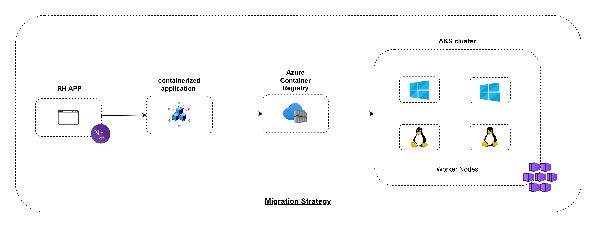

# Overview

Let's assume that our HR application is not yet on the final target, so:
- It could be not yet been fully migrated or transformed to reach its target architecture or final environment (which could be AKS or another planned destination).
- It could be still operating in a legacy environment (`on-premises`, traditional `VMs`, or another cloud service).
- It could be in a transitional phase, with constraints or steps to complete before achieving the desired state (such as breaking down into microservices, or adopting DevOps practices).

> Migrating to AKS will allow the HR application to scale dynamically during peak times, such as recruitment drives, ensuring improved user experience and business agility.

## Migration strategy

To migrate our `.NET` HR application to Azure Kubernetes Service (AKS), here are the steps and considerations I propose:

1. Analyze requirements (**scalability, availability, security**) to prepare the field.
   - Plan cluster size, networking, and security (RBAC, Key Vault).
   - Set up observability with Azure Monitor.

2. Package the `HR app` to container image
   -  to goal is to reproduce the app on the same way whatever the environment we use (dev, staging, prod)

3. Azure container registry
   - Put container image in a place that is accessible for the host (VM) that going to run the application.

4. Prepare the CI/CD pipelines, so that we can
   - Automate the build and deployment of our containerized services.
   - Test in isolated staging environments.

5. **Progressive Migration** to AKS

   5.1. Prepare a rollback mechanism.

   5.2. Test each service or component in the AKS environment.
     - Ensure the application functions as expected under real-world conditions.

   5.3. Migrate our non-critical services first, followed by critical ones.

6. **Post migration**
   - Monitor costs and optimize resource usage with Azure Advisor.
   - Train the team on the operation and maintenance of AKS.
   - Document procedures and best practices.

### Technically speaking

- To package  our app into container images we could create:
  - `docker file(s)` which is a recipe of how our container is actually built.
  - `YAML` file(s) that describes how to deploy that container image on our application which can be composed of one or multiple containers.

- We can use [Azure Migrate service](https://learn.microsoft.com/en-us/azure/migrate/migrate-services-overview) that simplifies the process of migrating applications to Azure Kubernetes Service (AKS) by providing tools for assessment, planning, and execution.

### Resources
- [Migrate to Azure Kubernetes Service](https://learn.microsoft.com/en-us/azure/aks/aks-migration?tabs=azure-cli)
- [ASP.NET app containerization and migration](https://learn.microsoft.com/en-us/azure/migrate/tutorial-app-containerization-aspnet-kubernetes)
- [Azure Migrate](https://azure.microsoft.com/fr-fr/products/azure-migrate)