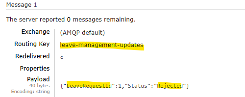

# Leave Management API

Explore the full API documentation to understand how each endpoint works: [API doc](./Docs/API-doc.md).

## Overview

The Leave Management API is designed to manage employee leave requests and approvals efficiently. It is implemented with robust architectural principles, providing flexibility and testability.

### Key Features:
- Built using `Hexagonal clean architecture` and following the `Domain Driven Design` principles.
- Employs an `in-memory database` for simplified setup, isolated data handling, and flexible testing environments.
- Implements local [RabbitMQ](https://www.rabbitmq.com/) message sending in the solution to prepare for future update leave requests `real-time notifications` in a front-end app.
  - Enabling it to subscribe to previously sent message queues through `SignalR` configuration for example.
- Achieves `80%+` test coverage for critical functionalities, ensuring high reliability.

    

## Architecture diagram

This architecture diagram visually represents the system's components, their relationships, and their interactions, emphasizing separation of concerns, scalability, and alignment with business requirements.
    

## Running Locally

1. Open the project and review the unit tests to gain a deeper understanding of the domain primary use cases. Here is an example:
    
2. Start the API (`.csproj`) in your development environment.
3. Use `Swagger Open API UI` to interact with the API. 

### Monitoring
- For app monitoring run the [Aspire](https://learn.microsoft.com/en-us/dotnet/aspire/get-started/aspire-overview) `Monitoring.AppHost` project for local monitoring and real time logs.

### Message broker
- For sending `update leave request messages`, use docker in your system to install RabbitMQ:
   - `docker run -d --name rabbitmq -p 5672:5672 -p 15672:15672 rabbitmq:management`.
   - here is an example of already sent queue messages:

   
     

## Future Enhancements

1. **Leave Balance Verification**

    Implement a feature to track and calculate the remaining leave days for employees based on the maximum allowable days for each leave type.

2. **Real-Time Notifications**

    Introduce a real-time notification through [SignalR](https://learn.microsoft.com/en-us/gaming/playfab/features/real-time-notifications/signalr-hub) to subscribe on leave request approvals or rejections, ensuring timely communication.

## Bonus Question

- Explore this [documentation](./Docs/AKS-migration_solution.md) to review the solution.
