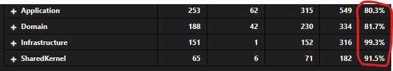
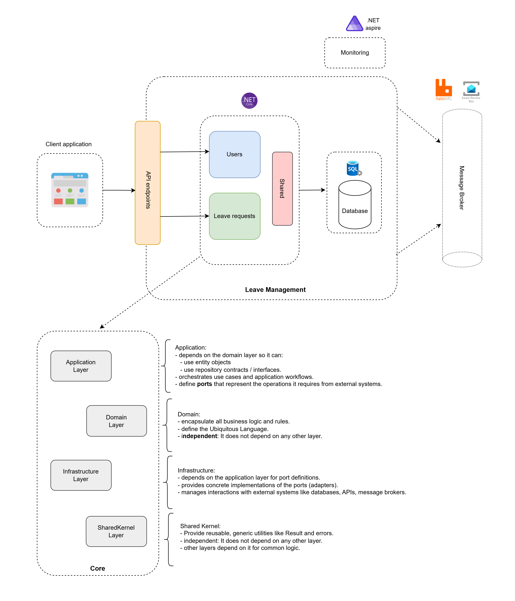
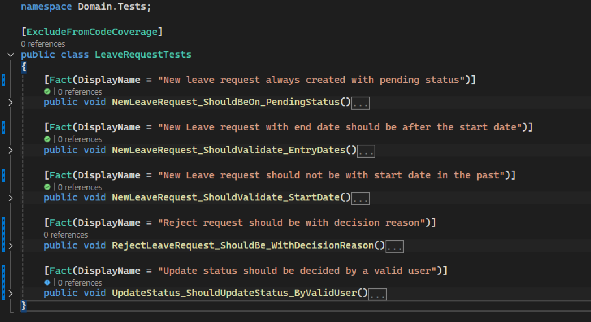

# Leave Management API

Explore the full API documentation to understand how each endpoint works: [API doc](./Docs/API-doc.md).

## Overview

The Leave Management API is designed to manage employee leave requests and approvals efficiently. It is implemented with robust architectural principles, providing flexibility and testability.

### Key Features:
- Built using `Hexagonal clean architecture` and following the `Domain Driven Design` principles.
- Employs an `in-memory database` for simplified setup, isolated data handling, and flexible testing environments.
- Achieves `80%+` test coverage for critical functionalities, ensuring high reliability.

    

## Architecture diagram

This architecture diagram visually represents the system's components, their relationships, and their interactions, emphasizing separation of concerns, scalability, and alignment with business requirements.

## Running Locally

1. Open the project and review the unit tests to gain a deeper understanding of the domain primary use cases. Here is an example:

    

2. Start the API (`.csproj`) in your development environment.
3. Use `Swagger Open API UI` to interact with the API. You can:
  - Register new users with different Roles `HR` or `Employee`.
  - Generate authentication tokens.
  - Submit new leave request for an employee.
  - Validate leave request.
  - Retrieve and filter user leave requests.

## Future Enhancements

1. **Leave Balance Verification**

    Implement a feature to track and calculate the remaining leave days for employees based on the maximum allowable days for each leave type.

2. **Real-Time Notifications**

    Introduce a real-time notification mechanism to subscribe to updates on leave request approvals or rejections, ensuring timely communication.

## Bonus Question

- Explore this [documentation](./Docs/AKS-migration_solution.md) to review the solution.
